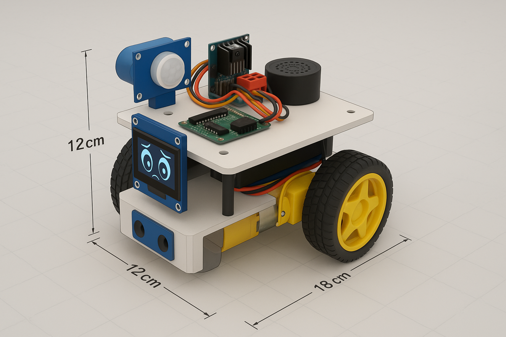

# Escape_bot🤖

## 📌 Overview  
This is an intelligent, interactive robot designed to follow humans, avoid collisions, and respond emotionally using a display and sound. It mimics human-like behavior by showing “emotions” on a screen and reacting when someone gets too close.

---

## 🧠 Key Features

### 🏃‍♂️ Human-Following Mode
- Uses ultrasonic and motion sensors to detect and follow a person.
- Stops before crashing into them.
- Displays **happy** or **excited** eyes on a **1.3" OLED screen**.

### 🚫 Personal Space Reaction
If someone gets too close from behind:
- 🔙 Moves backward.
- 🔊 Plays a sound: _“Don’t touch me!”_
- 😨 Displays **fearful** or **angry** eyes on the screen.

### 👁️ Emotion Display
- Uses a **1.3-inch I2C OLED display** to show cartoon-style eye expressions.
- Eye expressions change based on mood:
  - 😊 Happy when following.
  - 😱 Fearful when escaping.

---

## 🔧 How It Works

### 🔍 Sensors
- **Front ultrasonic sensor** → detects the human to follow.
- **Back ultrasonic sensor** → detects if something is too close.
- **PIR or IR sensor** → detects general movement.

### 🎮 Control
- Powered by **Arduino Uno/Nano**
- Processes sensor data and controls actions.

### 🔄 Motion
- Two **DC motors** for movement.
- Controlled via **L298N motor driver module**.

### 📣 Feedback
- **Buzzer or speaker** plays sound effects like “Don’t touch me!”
- **OLED screen** displays cartoon eyes based on robot’s emotion.

---

## ⚙️ Applications
- 🤖 Robotics learning & prototyping
- 🧪 Emotional AI experiments
- 🎨 Interaction design & human-robot interaction (HRI)
- 🎡 Fun personal project or science fair demo

---

## 📸 Demo (Optional)
__

---

## 📦 Components Used
| Component              | Description                          |
|------------------------|--------------------------------------|
| Arduino Uno / Nano     | Microcontroller                      |
| HC-SR04 Sensors        | Ultrasonic for front and rear       |
| PIR / IR Sensor        | Movement detection                  |
| L298N Module           | Motor driver                         |
| DC Gear Motors         | For movement                         |
| Buzzer / Speaker       | For audio feedback                   |
| 1.3" I2C OLED Display  | For showing emotional expressions    |
| Power Supply (Li-ion)  | For powering the robot               |

---

## 🛠 Future Improvements
- 🔋 Add battery level monitoring.
- 📡 Add Bluetooth/WiFi for remote commands.
- 🧠 Use AI-based tracking for smarter behavior.

---

## 🙋‍♂️ Author
**Ajaykumar Dodmani**  
[@AjaykumarDodmani](https://github.com/Ajaykumar-dodmani)

---

## 📜 License
[MIT License](https://choosealicense.com/licenses/mit/)
